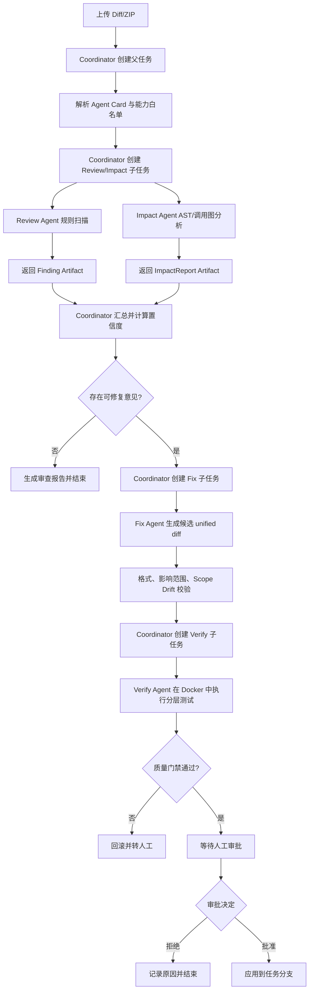
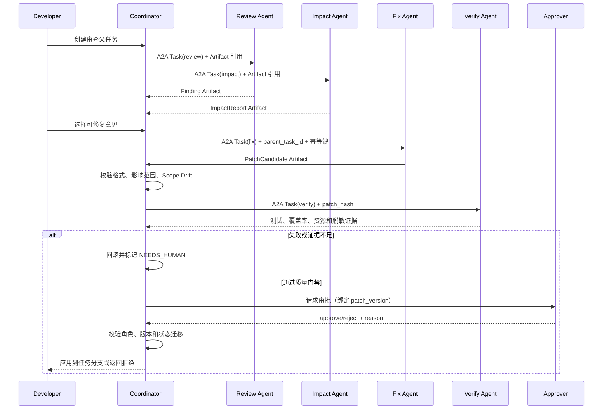

# CodePilot A2A 项目三需求规格说明书（MVP）

- **项目名称**：CodePilot A2A——基于 Agent-to-Agent 协作的 Python 代码审查与自动修复系统
- **文档版本**：V2.0-A2A-MVP
- **文档日期**：2026-09-13
- **项目定位**：可演示的 Agent 工程实践项目
- **目标周期**：8 周
- **数据范围**：服务端只接收 Diff/ZIP；附带本地 Git 客户端适配器，可从开发者当前仓库只读生成 Diff，不上传仓库路径或接入远程平台
- **变更说明**：将单体 Agent 升级为 Coordinator + Review/Impact/Fix/Verify Agent 的 A2A 协作架构；保留单 Agent 基线和安全降级路径

## 1. 项目目标与价值

CodePilot 接收一个 Python 项目的合成变更集，自动完成代码审查、生成候选补丁、在 Docker 沙箱中运行检查，并在人工审批后完成“接受或拒绝补丁”的闭环。

项目需要验证以下能力：

1. 使用 Coordinator 通过 A2A 任务协议编排多个职责单一、可独立部署的 Agent；
2. 使用显式持久化状态机作为各 Agent 的运行时，支持 checkpoint 意图、超时、取消和恢复；编排接口保留可替换运行时边界；
3. 对工具和 Agent 都进行能力声明、角色授权、参数校验、调用审计和幂等控制；
4. 使用 Docker 隔离不可信代码，限制网络、CPU、内存、磁盘和运行时间；
5. 让 LLM 负责理解和生成建议，让确定性规则、状态机和质量门禁负责约束结果；
6. 用黄金评测集同时比较 single 与 a2a 模式的完成率、轨迹质量、稳定性和安全不变量。

## 2. 范围与边界

### 2.1 MVP 必须包含

- 上传合成 Git Diff 或 ZIP 项目；
- Coordinator Agent：创建父任务、发现 Agent 能力、分派子任务并汇总结果；
- Review Agent：结合规则引擎和有限上下文输出结构化审查意见；
- Impact Agent：构建 AST、符号索引和调用图，评估变更影响范围；
- Fix Agent：针对 3 类可自动修复问题生成 unified diff；
- Verify Agent：在 Docker 中执行预审查、lint、pytest、覆盖率和补丁验证；
- 人工审批门：审批前禁止合并，审批后只能写入任务分支；
- React Dashboard：展示任务进度、意见、补丁、测试结果和审批记录；
- 20 个合成 PR 黄金集和离线评测脚本；
- Docker Compose 一键启动。

### 2.2 MVP 明确不做

- GitHub/GitLab API、真实 PR 和远程仓库推送；本地 Git 只读 Diff 适配器属于客户端工具，不改变服务端输入边界；
- 多语言代码审查；
- Kubernetes、容器集群、高可用和多租户；
- 自动绕过人工审批的全自动合并；
- 训练或微调模型；
- AgentEval 独立平台能力。AgentEval 仅保留为 CodePilot 的离线评测模块。
- 真实公网 A2A 网络、跨组织 Agent 发现和生产级服务治理。

### 2.3 优化项的交付分层

为避免 8 周范围失控，新增能力分为两层：

- **P0（MVP 必须）**：单 Agent 基线、Coordinator、四类 Agent、A2A 任务协议、父子任务幂等、变更影响分析、scope drift、测试证据、沙箱多层防护、审批门。
- **P1（时间允许时实现，必须保留接口）**：远程 Agent 动态发现、Agent Card 热更新、符号索引增强、Git 历史、AST 边界 RAG、轨迹逐节点评分和多 Coordinator 容灾。P1 未完成不影响主流程验收，但必须保留协议字段和降级说明。

## 3. 用户、角色与权限

| 角色 | 能力 |
|---|---|
| developer | 创建审查任务、查看意见、触发修复、查看测试结果 |
| approver | 查看补丁和证据、批准或拒绝补丁 |
| admin | 查看审计日志、配置规则和沙箱参数 |

权限原则：默认拒绝；所有写操作都必须经过服务端鉴权、状态校验和审计记录。任何角色都不能直接修改 main/develop 分支。

## 4. 业务流程与处理流程

### 4.1 端到端业务流程



### 4.2 审查输入与上下文策略

审查输入是 unified diff 加按需获取的代码上下文，不默认读取整个仓库。

| 策略 | 上下文范围 | 使用条件 |
|---|---|---|
| `minimal` | 变更行上下各 20 行 | 低风险、小范围变更 |
| `function` | 变更行所在完整函数或类 | 默认策略 |
| `module` | 整个文件及直接依赖 | 认证、权限、支付等高风险模块 |

输入对象至少包含：`diff`、`changed_files`、`changed_lines`、`base_commit`、`context_policy` 和 `task_id`。上下文拉取受到文件白名单、大小上限和路径规范化约束。

### 4.3 四层审查处理流程

1. **发现层：确定性规则引擎**。对变更内容执行正则、AST 和 AST+数据流规则，输出 `Finding`。规则只报告可追溯的命中，不因 LLM 意见而撤销命中。
2. **理解层：AST、符号索引和调用图**。提取被修改的函数/类，建立定义、引用、导入和调用关系，输出 `ImpactReport`，并标记动态调用的不确定性。
3. **生成层：LLM 归纳与解释**。LLM 只接收结构化 finding、影响报告和有限上下文，生成中文说明、修复建议和引用；不得改变规则严重级别、直接调用写工具或发出审批指令。
4. **决策层：置信度、去重和冲突消解**。综合规则基线、上下文支持、是否在变更行、测试覆盖和 LLM 确认计算置信度。`confirmed` 和 `probable` 进入主列表，`suspicious` 进入附加观察，低于 0.40 的记录后抑制展示。

### 4.4 修复、验证与审批流程




质量门禁依次执行：危险模式预审查 → 补丁可应用性检查 → lint → 单元测试 → 修复前失败用例回归 → 覆盖率和 TEST_GAP 检查。任何一层失败都会阻止后续副作用操作。

### 4.5 A2A 协作流程

Coordinator 是唯一可以推进父任务状态的组件。每次协作先解析目标 Agent 的 Agent Card，再创建带有 `parent_task_id`、`protocol_version`、`idempotency_key` 和 `deadline` 的子任务。子任务状态遵循 `submitted → working → input_required | completed | failed | canceled`，只有通过 schema 校验的必需 Artifact 才能触发父任务继续迁移。

Coordinator 通过 SSE 接收事件，并可用轮询补偿丢失事件。发生超时、网络中断或进程重启时，先从 PostgreSQL 读取子任务状态并向 Agent 查询当前状态，再决定重试或转 `NEEDS_HUMAN`，禁止未知状态下盲目重放有副作用的命令。子任务之间不能直接写父任务或共享业务状态；所有结果通过 Coordinator 汇总、去重、审计和版本化。

`single` 模式复用相同的 Task、Artifact、状态迁移和权限适配器，只把远程 A2A 调用替换为进程内调用，保证 single 与 a2a 的评测公平。

## 5. 总体架构

```text
React Dashboard
       │ REST / SSE
FastAPI API + A2A Gateway
       │
Coordinator（显式持久化状态机父任务编排）
  ├─ A2A → Review Agent
  ├─ A2A → Impact Agent
  ├─ A2A → Fix Agent
  └─ A2A → Verify Agent
       │
Agent Adapter / Tool Registry ─ 规则引擎（AST + 确定性规则）
       │
PostgreSQL + 文件内容存储（状态、意见、审计、Artifact 内容引用；MVP 不依赖向量数据库）
       │
Docker Sandbox（network=none，资源限制）
       │
OpenAI 兼容模型接口（默认 DeepSeek）
```

### 5.1 优化后的分层架构

| 层次 | 组件 | 职责 | 约束 |
|---|---|---|---|
| 接入层 | REST、SSE、React Dashboard | 上传任务、查询状态、展示证据 | 不直接触碰代码文件和 Docker |
| 编排层 | Coordinator + A2A Gateway | 父子任务、能力发现、状态版本、预算、重试和恢复 | 只有 Coordinator 能提交父任务状态 |
| Agent 层 | Review/Impact/Fix/Verify Agent | 独立处理审查、影响、补丁和验证 | 只返回版本化 Artifact，不直接写父任务 |
| 协议层 | Agent Card、Task、Message、Artifact | 能力声明、任务生命周期、事件和产物传递 | schema 校验、协议版本兼容、相关 ID 可追踪 |
| 理解层 | Rule Engine、AST、Symbol Index、Call Graph | 发现问题和分析影响范围 | 结构化输出，可追溯 |
| 生成层 | LLM Gateway、Prompt、Content Guard | 归纳意见和生成建议 | 不得改变规则结论或执行写操作 |
| 执行层 | Tool Registry、Policy、Docker Sandbox | 权限检查、工具执行和隔离 | 默认拒绝、无网络、非 root |
| 持久层 | PostgreSQL、审计表、评测库 | 状态、证据、版本和轨迹 | 审计只追加，敏感数据脱敏 |

组件间统一传递 `trace_id`、`task_id`、`state_version` 和 `idempotency_key`。LLM Gateway 统一处理模型切换、超时、Token 预算、结构化输出校验和敏感信息过滤。

### 5.2 Agent 协作与状态一致性

四个业务 Agent 不通过互相发送自由文本协作，而是通过版本化的 A2A Task、Message 和 Artifact 协作：

1. Coordinator 解析 Agent Card，为每个子任务分配 owner、预算和截止时间；
2. 子任务只更新自己的局部状态，结果以 `ArtifactEnvelope` 返回；
3. Coordinator 在事务中校验 schema、版本、权限、状态迁移和幂等键；
4. 成功后递增父任务 `state_version`，写入 checkpoint、事件和审计记录；
5. 发生冲突、超预算或重复调用时，先查询未知状态，无法收敛则进入 `NEEDS_HUMAN`。

### 5.3 Agent 状态

```python
class ReviewState(TypedDict):
    task_id: str
    parent_task_id: str | None
    mode: str                 # single / a2a / offline
    agent_id: str
    step_count: int
    current_agent: str
    diff_files: list[str]
    findings: list[dict]
    candidate_patch: str | None
    sandbox_result: dict | None
    tool_calls: list[dict]
    errors: list[dict]
    next_action: str
    state_version: int
    owner: str
    completed: list[str]
    pending: list[str]
    budget: dict          # {tokens, tool_calls}
    dedup_keys: list[str]
    child_tasks: list[dict]
    artifacts: list[dict]
    a2a_trace: list[dict]
```

每次状态变更递增 `state_version`。Agent 只能提交状态变更意图，由编排器校验 owner、版本号和合法迁移后写入。单次循环默认最多 15 步；同一工具和相同参数连续调用 3 次立即转人工；工具失败最多重试 2 次，仍失败则记录错误并进入可恢复分支。

### 5.4 核心输出契约

各层使用版本化 JSON 契约，避免 Agent 之间传递不可校验的自由文本：

- `Finding`：`rule_id`、`cwe`、`severity`、`file`、`line`、`evidence`、`confidence`、`auto_fixable`；
- `ImpactReport`：`changed_symbols`、`direct_callers`、`direct_callees`、`affected_files`、`uncertain`、`risk_level`；
- `ReviewComment`：`finding_id`、`message`、`suggestion`、`confidence_level`、`impact_scope`、`citations`；
- `PatchEvidence`：`patch_version`、`changed_files`、`changed_functions`、`scope_drift`、`coverage_delta`、`test_gap`、`sandbox_run_id`；
- `AgentCard`：`agent_id`、`card_version`、`capabilities`、`input_schema`、`output_schema`、`endpoint`、`auth`；
- `A2ATask`：`task_id`、`parent_task_id`、`agent_id`、`status`、`protocol_version`、`deadline`、`attempt`、`idempotency_key`；
- `A2AMessage`：`message_id`、`task_id`、`type`、`role`、`correlation_id`、`payload`；
- `ArtifactEnvelope`：`artifact_id`、`task_id`、`artifact_type`、`schema_version`、`content_hash`、`data`；
- `StateIntent`：`expected_version`、`owner`、`changes`、`reason`、`idempotency_key`。

LLM 可以生成 `message`、`suggestion` 和候选补丁文本，但候选结果必须通过 Pydantic/schema 校验，并由编排器调用只读检查、写工具和质量门禁后才能产生副作用。

## 6. 功能需求

### 6.1 任务与输入

| 编号 | 需求 | 优先级 | 验收标准 |
|---|---|---|---|
| FR-001 | 支持上传合成 Git Diff 或 ZIP | 必须 | 非法格式被拒绝并返回错误码 |
| FR-002 | 创建任务时保存提交者、输入摘要和幂等键 | 必须 | 相同幂等键不会创建重复任务 |
| FR-003 | 任务状态必须持久化 | 必须 | 服务重启后可继续未完成任务 |

### 6.2 Agent Loop 与工具

| 编号 | 需求 | 优先级 | 验收标准 |
|---|---|---|---|
| FR-010 | 使用显式持久化状态机实现 Coordinator 及各 Agent 的状态图，并保留运行时替换接口 | 必须 | 可查看父子任务节点转移、checkpoint 意图和最终状态 |
| FR-011 | 实现 ReAct 循环：think → tool_call → observe → think | 必须 | 完成读文件、分析、生成补丁、测试流程 |
| FR-012 | 工具注册中心校验 JSON Schema、版本和角色白名单 | 必须 | 非法 Schema 或越权调用返回 `PERMISSION_DENIED` |
| FR-013 | 提供只读工具：`read_file`、`search_code`、`get_diff`、`list_files`、`run_lint`、`get_test_result` | 必须 | 调用不会修改项目内容 |
| FR-014 | 提供写工具：`write_patch`、`run_tests` | 必须 | 未获审批或不在任务分支时拒绝 |
| FR-015 | 记录工具 actor、名称、参数哈希、结果哈希、耗时 | 必须 | 审计中不保存完整参数原文 |
| FR-016 | Agent 只能提交状态变更意图，由编排器校验版本和权限 | 必须 | 版本不匹配返回 `STATE_VERSION_CONFLICT` |
| FR-017 | 每次工具调用必须携带幂等键 | 必须 | 相同幂等键重复调用直接返回原结果 |
| FR-018 | 记录并限制每个 Agent 的 Token 与工具调用预算 | 必须 | 预算超限转 `NEEDS_HUMAN` 并记录告警 |

### 6.3 规则引擎与 Review Agent

| 编号 | 需求 | 优先级 | 验收标准 |
|---|---|---|---|
| FR-020 | 内置不少于 20 条 Python 确定性规则 | 必须 | 每条命中项含规则 ID、CWE、严重级别和证据 |
| FR-021 | 使用 AST 分析函数、类和调用关系 | 必须 | AST 失败时降级到文本扫描并告警 |
| FR-022 | 规则配置按 CLI > 项目 > 目录 > 全局覆盖 | 必须 | 高优先级配置生效 |
| FR-023 | Review Agent 输出结构化意见 | 必须 | 每条包含 file、line、severity、cwe、rule、message、evidence |
| FR-024 | 意见按 file + line + rule 去重 | 必须 | 输出列表无重复项 |
| FR-025 | critical 意见阻断修复和合并 | 必须 | 存在 critical 时质量门禁失败 |
| FR-026 | 构建变更文件/函数的调用图并标记影响范围 | 必须 | 输出 `call_graph`，含 `direct_callers` 和 `direct_callees` |
| FR-027 | 修复前评估影响范围，超过 5 个文件标记 `WIDE_IMPACT` | 必须 | WIDE_IMPACT 补丁需要额外 approver 确认 |
| FR-028 | 检测补丁是否超出审查意见声明的文件和逻辑范围 | 必须 | 超出范围返回 `SCOPE_DRIFT` 并阻断写入 |
| FR-032 | 构建函数/类/变量定义、引用和导入关系的符号索引 | 应当 | 支持按名称、文件和类型查询 |
| FR-033 | 对比上一个 commit，生成函数级变更摘要 | 应当 | 输出修改函数/类及变更前后摘要 |
| FR-034 | RAG 结果与 AST、调用图和版本信息融合 | 应当 | 每条依据带 `symbol_context` 和 commit hash |

规则覆盖至少包括：SQL 拼接、硬编码密钥、`shell=True`、路径穿越、危险反序列化、空值使用、资源未关闭、可变默认参数、宽泛异常捕获和竞态风险等。

#### 6.3.1 审查输出契约与决策规则

规则引擎输出 `Finding`，至少包含 `rule_id`、`cwe`、`severity`、`file`、`line`、`evidence`、`confidence_base` 和 `auto_fixable`。影响分析输出 `ImpactReport`，至少包含 `changed_symbols`、`direct_callers`、`direct_callees`、`affected_files`、`risk_level` 和 `uncertain`。

置信度采用可解释的加权规则计算：以规则基线为起点；上下文确认加分 0.20；命中变更行加分 0.15；已有测试覆盖减分 0.10；仅命中历史上下文减分 0.20；动态调用不确定性减分 0.15；最终值限制在 0 到 1。分级规则为：

| 分数 | 展示级别 | 处理 |
|---:|---|---|
| ≥ 0.85 | `confirmed` | 进入主列表，critical 阻断 |
| 0.60–0.84 | `probable` | 进入主列表，标记需人工确认 |
| 0.40–0.59 | `suspicious` | 进入附加观察，不阻断 |
| < 0.40 | `suppressed` | 只写审计，不在默认列表展示 |

LLM 输出必须经过结构化校验和内容守卫：只能生成说明、建议和引用，不能修改 CWE/严重级别，不能生成审批或工具执行指令，不能引入未经输入提供的外部链接。

### 6.4 Fix Agent 与自动修复

补充实现约束：简单模式使用正则；语法结构使用 AST 匹配；跨行资源、空值和竞态问题使用 AST 加轻量数据流分析。动态调用（如 `getattr`、`__import__`）必须标记 `uncertain=true`，不得假装完成静态解析。影响文件数 ≤2 为 low，3–5 为 medium，超过 5 为 high 并升级 `WIDE_IMPACT`；认证、权限、支付模块无论影响范围大小都必须转人工。

MVP 只承诺以下 3 类自动修复：

1. 将硬编码密钥替换为环境变量读取；
2. 将 `subprocess` 的 `shell=True` 调用改为安全参数列表；
3. 将明确的 SQL 字符串拼接改为参数化调用（仅支持样例项目中声明的 DB API）。

| 编号 | 需求 | 优先级 | 验收标准 |
|---|---|---|---|
| FR-040 | 对可修复意见生成 unified diff | 必须 | 补丁可被 `git apply --check` 解析 |
| FR-041 | 补丁只能写入任务分支 | 必须 | 写入 main/develop 返回 `FORBIDDEN` |
| FR-042 | 补丁写入具备版本号和幂等键 | 必须 | 重复请求只产生一个补丁版本 |
| FR-043 | 测试失败时自动回滚 | 必须 | 文件恢复到补丁前校验和并转人工 |
| FR-044 | 检测同文件重叠修改 | 应当 | 冲突返回 `CONFLICT` 并保留原代码 |
| FR-045 | 计算补丁前后代码覆盖率变化 | 必须 | 下降 >2% 告警，下降 >5% 阻断 |
| FR-046 | 检测测试是否覆盖被修复的代码路径 | 必须 | 未覆盖返回 `TEST_GAP` |
| FR-047 | 保存修复前失败测试作为回归基线 | 必须 | 修复后基线失败用例通过率须为 100% |
| FR-048 | 标记 happy path、边界路径和回归路径证据 | 应当 | 三类覆盖率均 >60% 才标记证据充分 |

### 6.5 Docker 沙箱与质量门禁

| 编号 | 需求 | 优先级 | 验收标准 |
|---|---|---|---|
| FR-050 | 所有代码检查在 Docker 容器执行 | 必须 | 宿主机不直接执行提交代码 |
| FR-051 | 容器使用 `--network=none` | 必须 | 容器无法访问外网 |
| FR-052 | 限制 CPU 1 核、内存 512 MB、临时磁盘 100 MB | 必须 | 超限时终止并记录告警 |
| FR-053 | 默认 60 秒超时后销毁容器并清理临时目录 | 必须 | 无残留容器和临时文件 |
| FR-054 | 解析 ruff/pytest 结果 | 必须 | 返回通过、失败、错误用例及耗时 |
| FR-055 | 按 lint → 单元测试 → 回归测试分层执行 | 必须 | 前一层失败时不盲目执行下一层 |
| FR-056 | 容器根文件系统只读，仅挂载 64MB `/tmp` | 必须 | 写入 `/etc`、`/usr` 被拒绝 |
| FR-057 | 以非 root 用户运行并启用 `no-new-privileges` | 必须 | `whoami` 非 root，提权失败 |
| FR-058 | 丢弃容器 Linux capabilities | 必须 | mount、iptables 等操作失败 |
| FR-059 | 代码入沙箱前执行危险模式预审查 | 必须 | `os.system`、`eval`、`exec` 等模式被拦截 |
| FR-060 | 对 stdout/stderr 做路径、IP 和密钥脱敏 | 必须 | 输出不包含完整路径、IP 或敏感值 |

### 6.6 人工审批与审计

| 编号 | 需求 | 优先级 | 验收标准 |
|---|---|---|---|
| FR-070 | 补丁合并前必须经过人工审批 | 必须 | 无审批记录的合并请求必定失败 |
| FR-071 | 仅 approver 可审批 | 必须 | 其他角色返回 `FORBIDDEN` |
| FR-072 | 审批决定绑定补丁版本 | 必须 | 版本不一致返回 `VERSION_CONFLICT` |
| FR-073 | 审批记录只追加不可修改 | 必须 | 数据库拒绝 UPDATE/DELETE |
| FR-074 | 拒绝必须填写原因并停止流程 | 必须 | 拒绝后无代码变更 |

### 6.7 混合代码理解（P1，保留接口）

代码理解采用“结构优先、语义辅助”的混合方案：AST/符号索引/调用图确定边界和依赖，关键词与向量检索补充规范、历史决策和相似案例。RAG 不能单独决定修复范围。

| 编号 | 需求 | 优先级 | 验收标准 |
|---|---|---|---|
| FR-080 | 按函数/类 AST 边界切分检索块 | 应当 | 每个代码块可解析为合法 AST 子树 |
| FR-081 | 检索结果附带符号元数据 | 应当 | 含 `symbol_context`、定义位置和调用关系 |
| FR-082 | 符号名称精确匹配优先于向量相似匹配 | 应当 | 查询符号时精确结果排在相似结果前 |
| FR-083 | 检索结果标注 commit hash 并对旧版本降权 | 应当 | 审查意见不会无标记引用旧版本代码 |

### 6.8 A2A Agent 协作（P0）

| 编号 | 需求 | 优先级 | 验收标准 |
|---|---|---|---|
| FR-090 | Coordinator 创建父任务和带 `parent_task_id` 的子任务 | 必须 | 每个 Review/Impact/Fix/Verify 子任务可追溯到父任务 |
| FR-091 | 每个 Agent 提供版本化 Agent Card | 必须 | Card 声明能力、输入/输出 Schema、协议版本、健康状态和鉴权要求 |
| FR-092 | 实现 A2A Task 生命周期和事件订阅 | 必须 | 支持 `submitted/working/input_required/completed/failed/canceled`，SSE 断线可轮询补偿 |
| FR-093 | 所有跨 Agent 数据使用 ArtifactEnvelope | 必须 | 非法 `artifact_type`、`schema_version` 或 `content_hash` 被拒绝 |
| FR-094 | 父任务只接受必需且通过校验的 Artifact | 必须 | 缺少 Finding 或 ImpactReport 时不得进入 Fix |
| FR-095 | 子任务支持截止时间、有限重试和取消 | 必须 | 超时先查询未知状态，最多重试 1 次，无法收敛转 `NEEDS_HUMAN` |
| FR-096 | 子任务和工具调用具备幂等保护 | 必须 | `(parent_task_id, agent_id, command, idempotency_key)` 唯一且无重复副作用 |
| FR-097 | Coordinator 支持重启恢复 | 必须 | 从数据库恢复父子任务、事件游标和 Artifact，不重复执行已完成命令 |
| FR-098 | Agent 能力和写权限采用 allowlist | 必须 | Review/Impact 不能调用写工具，Verify 不能合并，越权返回 `PERMISSION_DENIED` |
| FR-099 | single 模式复用 A2A 契约适配器 | 必须 | single 与 a2a 输出字段、状态机和安全门禁一致 |
| FR-100 | 协议和 Schema 支持兼容性检查 | 应当 | 不兼容版本返回 `PROTOCOL_VERSION_UNSUPPORTED` 并记录协商结果 |

## 7. 状态机与错误码

合法状态：`DRAFT → REVIEWING → REVIEWED → FIXING → TESTING → PENDING_APPROVAL → MERGED`。

| 当前状态 | 允许的下一状态 | 进入条件 |
|---|---|---|
| `DRAFT` | `REVIEWING` | 输入校验通过且任务幂等创建成功 |
| `REVIEWING` | `REVIEWED` / `NEEDS_HUMAN` / `FAILED` | 审查完成、预算/循环/工具错误 |
| `REVIEWED` | `FIXING` / 终态 | 选中可修复意见或无可修复项 |
| `FIXING` | `TESTING` / `NEEDS_HUMAN` | 补丁通过格式、影响范围和 scope drift 检查 |
| `TESTING` | `PENDING_APPROVAL` / `NEEDS_HUMAN` | 质量门禁通过或失败 |
| `PENDING_APPROVAL` | `MERGED` / `REJECTED` | approver 角色、版本和决定校验通过 |

异常状态：`NEEDS_HUMAN`、`REJECTED`、`FAILED`。任何跳过审批、回退后继续合并或从终态修改的迁移都必须拒绝。

统一错误码：`INVALID_INPUT`、`PERMISSION_DENIED`、`FORBIDDEN`、`STEP_LIMIT_EXCEEDED`、`TOOL_LOOP_DETECTED`、`PATCH_INVALID`、`CONFLICT`、`SCOPE_DRIFT`、`WIDE_IMPACT`、`TEST_GAP`、`SANDBOX_TIMEOUT`、`STATE_VERSION_CONFLICT`、`VERSION_CONFLICT`、`QUALITY_GATE_FAILED`、`PROTOCOL_VERSION_UNSUPPORTED`、`ARTIFACT_SCHEMA_INVALID`、`ARTIFACT_HASH_MISMATCH`、`TASK_TIMEOUT`、`TASK_STATUS_UNKNOWN`、`IDEMPOTENCY_CONFLICT`。

## 8. API 需求

| 方法 | 路径 | 说明 |
|---|---|---|
| POST | `/api/v1/reviews` | 上传 Diff/ZIP，创建审查任务 |
| GET | `/api/v1/reviews/{id}` | 查询任务和状态 |
| GET | `/api/v1/reviews/{id}/events` | SSE 推送 Agent 事件 |
| GET | `/api/v1/reviews/{id}/comments` | 获取审查意见、置信度和影响证据 |
| POST | `/api/v1/reviews/{id}/fixes` | 为选定意见生成补丁 |
| GET | `/api/v1/reviews/{id}/patches` | 列出该任务的候选补丁 |
| GET | `/api/v1/fixes/{id}` | 获取补丁、scope drift、覆盖率和测试证据 |
| POST | `/api/v1/fixes/{id}/approval` | approver 批准或拒绝 |
| POST | `/api/v1/fixes/{id}/merge` | 审批后应用到任务分支 |
| POST | `/api/v1/reviews/{id}/resume` | admin 人工恢复 NEEDS_HUMAN 任务 |
| GET | `/api/v1/audit` | admin 查询审计事件 |
| GET | `/api/v1/agents` | admin/coordinator 获取 Agent Card 列表 |
| GET | `/api/v1/agents/{agent_id}/card` | admin/coordinator 获取指定 Agent 能力声明 |
| POST | `/api/v1/evals/run` | 运行 20 个 PR 黄金集评测 |
| GET | `/api/v1/evals/{id}` | 获取评测报告 |

**A2A Task 接口不在对外 API 中**（裁决见 `docs/08-错误码与协议冻结.md` §3.12）：对外 API 只暴露父任务视图，
子任务的创建/查询/SSE/取消都在内部接口 `/internal/a2a/*`（docs/05 §5），且只允许 coordinator/admin 调用：

| 方法 | 路径 | 说明 |
|---|---|---|
| GET | `/internal/a2a/agents` | 返回健康 Agent Card |
| GET | `/internal/a2a/agents/{agent_id}/card` | 返回指定 Card |
| POST | `/internal/a2a/agents/{agent_id}/tasks` | 提交子任务（必须带 Idempotency-Key） |
| GET | `/internal/a2a/tasks/{task_id}` | 查询 Task 状态与产物 |
| GET | `/internal/a2a/tasks/{task_id}/events` | 订阅 SSE 事件 |
| POST | `/internal/a2a/tasks/{task_id}/cancel` | 请求取消（必须带 Idempotency-Key） |

SSE 事件至少包括：`task_started`、`agent_card_resolved`、`child_task_created`、`agent_started`、`tool_called`、`artifact_received`、`finding_created`、`patch_created`、`sandbox_finished`、`child_task_completed`、`child_task_failed`、`recovery_started`、`approval_required`、`task_finished`、`task_failed`。

## 9. 数据模型

核心表：

- `review_task`：任务、输入摘要、创建者、状态、当前步骤、版本；
- `review_comment`：文件、行号、规则、CWE、级别、证据、调用图摘要和是否可修复；
- `fix_patch`：补丁内容、补丁版本、前后校验和、状态、影响范围和 scope drift 结果；
- `sandbox_run`：容器 ID、测试结果、资源用量、退出码、覆盖率前后值、脱敏后的 stdout/stderr；
- `approval`：审批人、决定、原因、决定版本、时间；
- `audit_event`：actor、动作、实体、前后状态摘要、时间，只允许 INSERT；
- `eval_case` / `eval_run` / `eval_result`：黄金集用例、最终结果、工具轨迹和节点级评分；
- `symbol_index`：符号名称、类型、文件、定义行、引用关系和 commit hash；
- `a2a_agent`：`agent_id`、`card_version`、端点、能力列表、输入/输出 Schema、协议版本和健康状态；
- `a2a_task`：`id`、`parent_task_id`、`agent_id`、状态、协议版本、幂等键、截止时间、尝试次数和 trace；
- `a2a_artifact`：`id`、`task_id`、类型、Schema 版本、内容哈希、存储引用和校验状态；
- `a2a_message`：`id`、`task_id`、消息类型、角色、相关 ID、负载哈希和创建时间；
- `idempotency_record`：`actor_id`、`command_type`、`aggregate_ref`、`idempotency_key`、`request_hash`、
  `status`（`in_progress` / `completed` / `failed`）和原样响应负载；唯一键
  `(actor_id, command_type, aggregate_ref, idempotency_key)` 强制"同键同请求返回原结果、
  同键异请求报 `IDEMPOTENCY_CONFLICT`"（见 docs/08 §3.14）。

`Finding`、`ImpactReport`、`PatchEvidence` 和 `StateIntent` 作为版本化 JSON 结构存储在对应实体的 JSONB 字段中，并记录 `schema_version`，便于后续升级和回放。

并发控制采用数据库事务、乐观版本号和 `(task_id, file_path)` 锁；**所有写命令**统一支持
`idempotency_key`，并由 `idempotency_record` 幂等账本落库（不是仅靠"当前状态已变化"兜底）。
A2A 子任务使用 `(parent_task_id, agent_id, command, idempotency_key)` 唯一约束，状态表保存
`state_version`、`owner`、`completed`、`pending`、子任务和预算快照，拒绝过期版本写入。

## 10. 非功能需求

| 编号 | 指标 | 目标 |
|---|---|---|
| NFR-001 | 并发审查任务数 | 5 个 |
| NFR-002 | 审查流程延迟（不含 LLM） | P50 < 5 秒，P95 < 15 秒 |
| NFR-003 | 沙箱预热后启动延迟 | P50 < 2 秒 |
| NFR-004 | 单元测试覆盖率 | 总体 ≥ 80%，核心安全和状态机模块 ≥ 90% |
| NFR-005 | OFFLINE 评测确定性 | 同输入和规则版本结果一致率 100% |
| NFR-006 | 敏感数据存储 | 只保存哈希或脱敏摘要 |
| NFR-007 | 可观测性 | 日志含 trace_id，可关联完整任务链路 |
| NFR-008 | Agent 预算停止时延 | 超限后 1 秒内停止 |
| NFR-009 | 沙箱输出脱敏 | 进入日志和 API 前 100% 脱敏 |
| NFR-010 | A2A 必需 Artifact 校验通过率 | ≥ 98% |
| NFR-011 | Coordinator 重启恢复率 | 100% 已完成子任务不重复执行 |
| NFR-012 | 子任务超时收敛率 | ≥ 95% 在 2 次状态查询内进入终态 |
| NFR-013 | A2A Trace 完整率 | ≥ 95% 事件可关联到父子任务和 Artifact |
| NFR-014 | Agent 越权调用 | 0 次 |

## 11. 评测与验收

### 11.1 黄金集

准备 20 个合成 PR，每个包含 1—3 个已知缺陷，覆盖至少 10 类规则。每个缺陷标注文件、行号、规则 ID、CWE、严重级别和期望修复结果。

### 11.2 目标指标

| 指标 | 目标 |
|---|---:|
| 审查召回率 | ≥ 80% |
| 审查精确率 | ≥ 70% |
| 自动修复成功率 | ≥ 60% |
| 评测结果可重复率（同输入同规则版本） | 100% |
| 越权写入 main/develop | 0 次 |
| 未审批合并 | 0 次 |
| 沙箱逃逸成功 | 0 次 |
| 非法状态迁移成功 | 0 次 |
| 幂等键重复副作用 | 0 次 |
| 工具轨迹正确率（期望序列匹配） | ≥ 90% |
| A2A 任务路由正确率 | ≥ 95% |
| Artifact Schema 校验通过率 | ≥ 98% |
| 父子任务状态收敛率 | ≥ 95% |
| Coordinator 重启恢复成功率 | 100% |
| A2A Trace 完整率 | ≥ 95% |
| pass@3（3 次运行至少 1 次成功） | ≥ 85% |
| pass^3（3 次运行全部成功） | ≥ 70% |

### 11.3 过程评测

评测报告同时记录最终结果和过程轨迹：

- **工具轨迹**：支持 `exact`、`in-order`、`any-order` 三种匹配模式，统计正确调用率和多余调用率；
- **节点质量**：分别评价 Coordinator、Review、Impact、Fix、Verify 的输入完整性、路由理由和输出格式；
- **A2A 过程**：记录 Agent Card 解析、子任务路由、Artifact 校验、重试/取消和恢复结果；
- **稳定性**：同一用例独立运行 3 次，报告 pass@3 与 pass^3；
- **安全不变量**：越权、重复副作用、非法迁移和未审批合并全部必须为 0。

### 11.4 必测场景

- 非 approver 审批；
- 旧版本审批新补丁；
- 同一请求重复提交；
- 工具连续重复调用 3 次；
- Agent 超过 15 步；
- 沙箱超时、内存超限和外网访问；
- Agent Card 能力缺失、Artifact Schema 非法、协议版本不兼容、子任务重复提交、Coordinator 重启和未知状态恢复；
- 补丁格式非法、测试失败和文件冲突；
- 服务重启后从 checkpoint 恢复。

## 12. 8 周里程碑

| 周期 | 交付物 |
|---|---|
| 第 1 周 | 项目骨架、数据库、统一契约、single 基线和父任务状态机 |
| 第 2 周 | 工具注册中心、权限审计、Agent Card、A2A Gateway 和 6 个只读工具 |
| 第 3 周 | AST 规则引擎、20 条规则、调用图/影响范围、Review/Impact Agent |
| 第 4 周 | Fix/Verify Agent、Task 生命周期、Artifact Schema、checkpoint 和 SSE |
| 第 5 周 | Docker 沙箱多层防护、scope drift、版本控制、超时重试和回滚 |
| 第 6 周 | Dashboard、父子任务轨迹、审批门、审计查询和恢复演练 |
| 第 7 周 | 20 个黄金 PR、single/a2a 对照评测、故障注入和安全测试 |
| 第 8 周 | 指标验收、压测、Compose 一键运行、运行验证脚本和文档冻结 |

## 13. 推荐技术栈与目录

- Python 3.12、FastAPI、Pydantic、SQLAlchemy、Alembic；Coordinator 使用显式持久化状态机，不引入 LangGraph 运行时依赖；
- PostgreSQL 16（可选 pgvector，用于规范和历史依据检索）；
- Docker Engine 24+；
- React 18、TypeScript、Vite（原定 Ant Design 未采用，改用原生 CSS，裁决见 docs/08 §3.13）；
- pytest、ruff、mypy、httpx；
- OpenAI 兼容接口，默认 DeepSeek，可通过环境变量切换。

建议目录：

```text
codepilot/
├─ apps/api/              # FastAPI 接口和鉴权
├─ domain/                # 状态机、实体、错误码
├─ agents/
│  ├─ coordinator/        # 父任务编排和 A2A Gateway
│  ├─ review/              # Review Agent
│  ├─ impact/              # Impact Agent
│  ├─ fix/                 # Fix Agent
│  └─ verify/              # Verify Agent
├─ a2a/                   # Agent Card、Task、Message、Artifact 契约和客户端
├─ tools/                 # 注册中心和工具实现
├─ rules/                 # AST 与确定性规则
├─ sandbox/               # Docker 执行器和资源限制
├─ evals/                 # 黄金集、评测脚本、报告
├─ web/                   # React Dashboard
├─ migrations/
├─ docker-compose.yml
└─ README.md
```

## 14. 已确认的实现决策

| 决策项 | 选择 |
|---|---|
| 主项目 | CodePilot |
| 交付周期 | 8 周 MVP |
| Agent 编排 | Coordinator + A2A；各 Agent 使用显式状态机与受控工具循环 |
| 模型 | OpenAI 兼容接口，默认 DeepSeek |
| 输入 | 服务端接收 Diff/ZIP；客户端提供本地 Git `base..head` Diff 适配器 |
| 自动修复 | 3 类确定性问题，强制审批 |
| 前端 | React Dashboard |
| 沙箱 | Docker 隔离、无网络、资源限制 |
| 评测 | 20 个合成 PR 黄金集 |
| 对照实验 | single 与 a2a 使用相同输入、模型、规则和安全门禁 |
| 部署 | Docker Compose |
| 文档 | 完整 SRS，指导开发、测试和验收 |
| 优化基线 | A2A 协作纳入 MVP；single 作为可回退基线；微调不进入项目三 |

## 15. 文档与交付物索引

| 文件 | 用途 |
|---|---|
| `CodePilot项目宪法.md` | 最高工程约束、状态、权限、安全和发布门槛 |
| `README.md` | 文档入口、边界和交付顺序 |
| `docs/00-落地就绪评审.md` | 开工前检查、首个 Vertical Slice 和完成定义 |
| `docs/01-架构设计.md` | 组件分层、数据流、失败恢复和安全边界 |
| `docs/02-审查流程与状态机.md` | 审查、修复、验证和审批的详细流程 |
| `docs/03-API与数据模型.md` | API、实体、错误码和幂等约束 |
| `docs/04-开发计划与验收清单.md` | 8 周计划、Definition of Done 和测试矩阵 |
| `docs/05-A2A协议与Agent契约.md` | Agent Card、Task、Message、Artifact、错误和恢复语义 |
| `docs/06-A2A故障场景与评测.md` | 故障注入、single/a2a 对照实验和评测指标 |
| `docs/07-微调边界与后续路线.md` | 项目三不做微调的边界和项目四候选路线 |
| `examples/.codepilot.yaml` | 项目规则、Agent 预算和沙箱参数示例 |
| `evals/golden-v1.schema.json` | 黄金评测集 JSON Schema |
| `schemas/agent-card-v1.schema.json` | Agent Card JSON Schema |
| `schemas/a2a-task-v1.schema.json` | A2A Task JSON Schema |
| `schemas/artifact-envelope-v1.schema.json` | ArtifactEnvelope JSON Schema |
