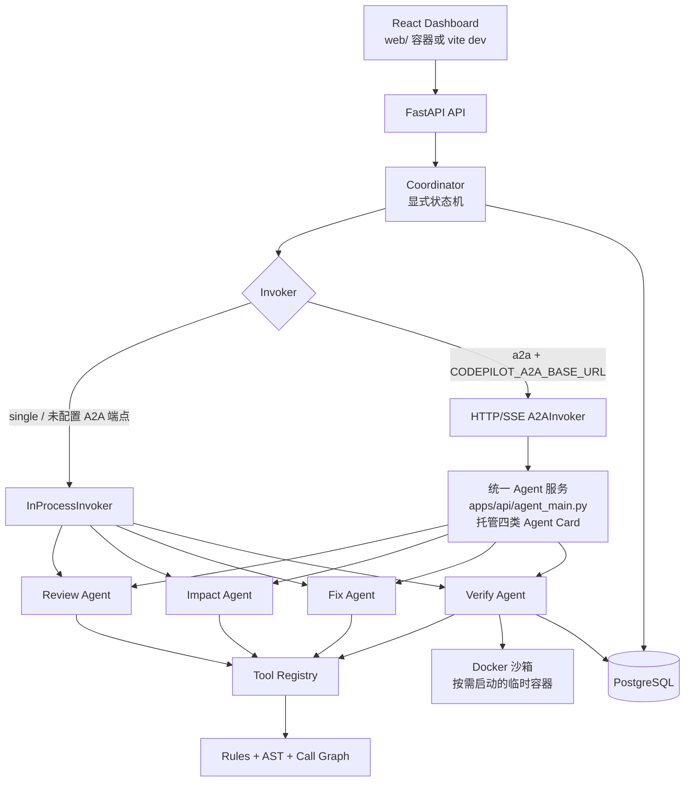

# CodePilot A2A 架构设计

> 本文档描述**当前实现**。历史设计里出现过的 LangGraph 编排、五容器拆分等方案已在实现阶段被替换，
> 差异与理由见 §9。

## 1. 设计原则

1. **职责分离**：规则负责发现，AST/调用图负责理解，LLM 负责归纳，Coordinator 负责路由和决策。
2. **协议优先**：Agent 之间只交换版本化的 Agent Card、Task、Message 和 Artifact，不共享未定义的自由文本状态。
3. **副作用集中控制**：Agent 不直接操作任务分支或容器，所有工具调用都经过注册中心和策略校验。
4. **状态可恢复**：父子任务、事件游标和 Artifact 都持久化；未知状态先对账，再决定重试。
5. **证据优先**：Finding、ImpactReport、PatchCandidate 和 VerifyEvidence 都必须关联来源、哈希和 trace。
6. **默认拒绝**：能力、工具、状态迁移、分支写入和审批均采用 deny-by-default。

## 2. 逻辑分层

| 层 | 组件 | 输入 | 输出 | 边界 |
|---|---|---|---|---|
| 接入层 | REST、SSE、Dashboard | Diff/ZIP、用户命令 | 父任务、事件、报告 | 不直接访问文件和 Docker |
| 编排层 | Coordinator（**显式确定性状态机**） | 父任务状态、策略 | 子任务、状态迁移、汇总结果 | 只有 Coordinator 能提交父任务状态 |
| 协议层 | A2A Gateway、Agent Registry | Agent Card、Task、Message | 路由、回执、事件 | 校验版本、能力和身份 |
| Agent 层 | Review、Impact、Fix、Verify | 结构化 Artifact | 版本化 Artifact、局部事件 | 不能直接写父任务或调用越权工具 |
| 理解层 | Rule Engine、AST、Symbol Index、Call Graph | 变更和代码上下文 | Finding、ImpactReport | 输出可追溯结构化结果 |
| 生成层 | LLM Gateway、Prompt、Guard | 结构化结果和有限上下文 | Comment、PatchCandidate | 不能改变规则结论或执行审批 |
| 执行层 | Tool Registry、Policy、Docker Sandbox | 工具请求、补丁 | 工具结果、VerifyEvidence | 默认拒绝、无网络、非 root |
| 持久层 | PostgreSQL、Audit、Eval | 领域对象和事件 | 可恢复状态、报告和轨迹 | 审计只追加，敏感数据脱敏 |

编排运行时是 `agents/coordinator/coordinator.py` 中的**显式 Python 状态机**：`DRAFT → REVIEWING →
REVIEWED → FIXING → TESTING → PENDING_APPROVAL → MERGED`，每个迁移都经
`repositories/store.py::ReviewTaskStore.apply_intent` 做乐观版本校验 + 幂等键 + 追加式审计。
**LangGraph 不是当前运行时依赖**（`pyproject.toml` 中没有该依赖）。

## 3. 组件拓扑

Coordinator 为父任务 owner。Review 和 Impact 可以并行；Fix 只能在两个必需 Artifact 都通过校验后启动；Verify 只能接收已通过格式和 scope 校验的 PatchCandidate。Agent 之间不直接调用彼此。

**部署粒度**：`single` 是一个进程内的编排（API 内含 `/internal/a2a/*`）；`a2a` 是把同一套协议换成
HTTP/SSE，由一个**统一的 Agent 服务进程**托管四类 Agent Card。四类 Agent 的边界由 Agent Card、
capability allowlist 和独立 handler 保证，**不是一个 Agent 一个容器**。

## 4. 父子任务数据流

1. API 创建父任务并写入输入哈希、模式、策略和 `trace_id`。
2. Coordinator 读取 Registry 中的 Agent Card，校验能力、协议版本、输入 Schema 和 allowlist。
3. Coordinator 创建 Review、Impact 子任务，写入 `parent_task_id` 和幂等键；两者完成后汇总 Finding 与 ImpactReport。
4. 用户选择可修复意见后，Coordinator 创建 Fix 子任务。Fix 只返回 PatchCandidate，不产生分支写入。
5. Coordinator 运行格式、影响范围和 scope drift 门禁，再创建 Verify 子任务。
6. Verify 在 Docker 中运行危险模式检查、lint、单测、回归测试和覆盖率，返回 VerifyEvidence。
7. Coordinator 根据证据推进状态，质量门禁通过后请求人工审批；批准后才调用写分支工具。

所有跨边界消息都带 `trace_id`、`task_id`、`parent_task_id`、`correlation_id`、`protocol_version` 和 `idempotency_key`。大内容通过 Artifact 引用传递，消息只携带摘要和哈希。

## 5. 部署形态

`docker compose up -d postgres api web`（单进程形态）与
`docker compose --profile split up -d postgres api agent web`（拆分形态），两者共享同一 PostgreSQL、
规则版本、工具策略和 Artifact Schema。拆分形态只需在 `.env` 中声明
`CODEPILOT_A2A_BASE_URL=http://agent:8100`（容器内不能写 `127.0.0.1`，那指向 API 容器自身）。

传输层可自证：`GET /readyz` 返回 `transport`（`inprocess` / `http`），启动日志打印
`A2A transport=...`。边界与验证命令见 README §1.1 与 `docs/10-个人开发者验收与演示剧本.md`。

远程 Agent 的公网发现、跨组织身份和生产级服务网格明确不做（宪法第十一条、§9）。Registry 使用
静态 Agent Card + 启动时一致性校验（Card 能力必须覆盖策略必需能力，否则进程拒绝启动）。

## 6. 失败与恢复

| 故障 | 处理 | 终态或重试条件 |
|---|---|---|
| Agent Card 不兼容 | 拒绝创建子任务并记录协商结果 | `PROTOCOL_VERSION_UNSUPPORTED` |
| Agent Card 能力缺失 | 启动即拒绝（静态 Registry）；运行期协商失败记录 `CAPABILITY_NOT_AVAILABLE` | `NEEDS_HUMAN` |
| A2A 请求超时 | 查询子任务状态；仅在明确未执行时重试一次 | 仍未知则 `NEEDS_HUMAN` |
| Agent 返回非法 Artifact | 丢弃结果，保留原始哈希和错误摘要 | `ARTIFACT_SCHEMA_INVALID` / `ARTIFACT_HASH_MISMATCH` |
| 网络断开/SSE 丢事件 | 从最后事件游标轮询任务和 Artifact | 状态收敛后继续 |
| Coordinator 重启 | 从数据库恢复父任务、子任务和 checkpoint | 已完成子任务不得重放 |
| 重复命令 | 幂等账本命中历史结果 | 返回原结果，不产生副作用 |
| LLM 超时 | 重试一次；Review 可只返回规则结果，Fix 转人工 | `MODEL_TIMEOUT` 或 `NEEDS_HUMAN` |
| 沙箱超时或资源超限 | kill 容器、清理目录、脱敏输出 | `SANDBOX_TIMEOUT` / `QUALITY_GATE_FAILED` |
| 沙箱不可用 | 安全降级：只保留规则与报告链路 | `SANDBOX_UNAVAILABLE`（绝不改在宿主机执行） |
| 测试失败或 scope drift | 不写分支，保留补丁与证据（含失败层级） | `NEEDS_HUMAN` |

恢复逻辑遵循"查询优先、幂等重试、终态保护"。任何 Agent 都不能通过重试绕过审批或状态迁移。

## 7. 安全边界

- Coordinator 根据 Agent Card 的能力 allowlist 创建任务；Review/Impact 无写工具，Verify 无合并工具。
- A2A Gateway 校验调用方身份、父子关系、协议版本、任务状态和幂等键。
- Tool Registry 校验 JSON Schema、角色、资源范围和预算，并记录参数哈希和结果哈希。
- Docker 使用 `network=none`、非 root、只读根文件系统、`cap_drop=ALL`、CPU/内存/磁盘/超时限制。
- 任务分支是唯一可写目标；`main` / `master` / `develop` 在策略层（`PROTECTED_BRANCHES`）拒绝写入。
- 审批记录只追加，补丁版本和内容哈希必须绑定，审计事件可按 trace 完整回放。

## 8. 可观测性

事件字段至少包含 `trace_id`、`parent_task_id`、`task_id`、`agent_id`、`event_type`、`state_version`、`artifact_id`、`idempotency_key`、耗时和错误码。指标分为四组：任务完成与延迟、Agent 路由与 Artifact 校验、工具和模型预算、权限与沙箱安全不变量。Dashboard 展示父任务时间线，并支持展开每个子任务和 Artifact。

## 9. 与早期设计的偏离（实现为准）

| 早期设计 | 当前实现 | 理由 |
|---|---|---|
| Coordinator 使用 LangGraph | 显式确定性状态机 + 持久化 state intent | 迁移可枚举、可测试、可审计；LangGraph 会引入绕过数据库约束的第二状态库（宪法第三条） |
| `coordinator` + 四类 Agent = 五个服务容器 | 统一 Agent 服务进程（split profile）+ 单进程形态 | 个人开发者边界；Agent 边界由 Card/allowlist/handler 保证，容器数量不是边界 |
| SQLite 作为部署数据库 | PostgreSQL 是部署事实来源，SQLite 仅用于测试与故障注入 | 宪法第三条 |
| Dashboard 计划用 Ant Design | React 18 + TS + Vite + 原生 CSS | 见 `docs/08` §3.13 |
| 沙箱常驻服务 | 每次验证按需创建临时容器（`network=none`、只读根、tmpfs） | 降低常驻攻击面与资源占用 |
| 修订：diff 输入的沙箱基线 | 工作区后像补齐结尾换行 | diff 重建的后像缺少结尾换行会导致 `git apply --check` 整段失败（已修复，见 `docs/08` §3.15） |
