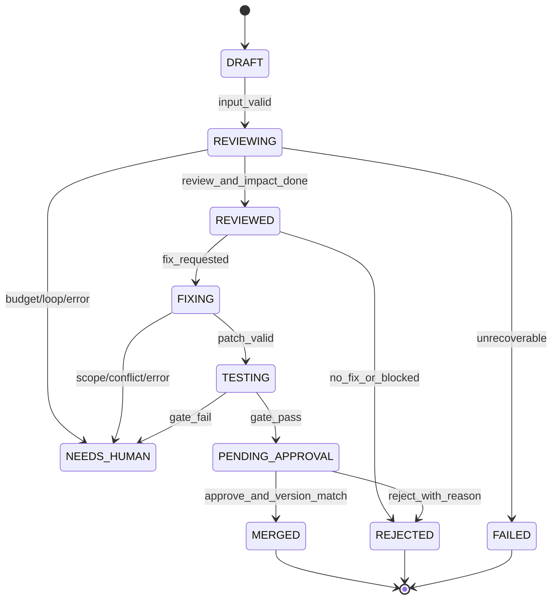
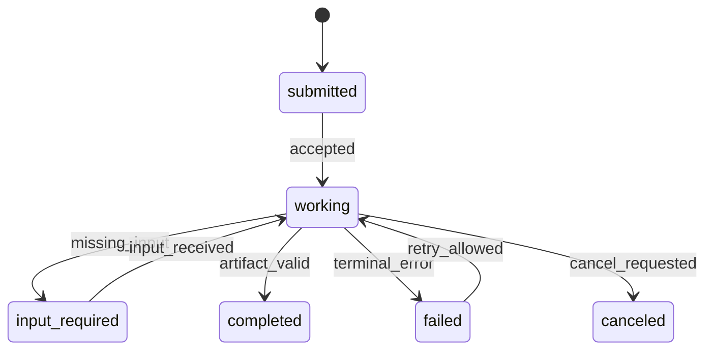

# CodePilot A2A 审查流程与状态机

## 0. 任务层级

系统包含一个父任务和四类子任务：`review`、`impact`、`fix`、`verify`。Coordinator 持有父任务状态；Agent 只持有自己的子任务状态并返回 Artifact。`single` 模式仍创建同样的逻辑子任务，只使用进程内适配器。

## 1. 审查处理步骤

### Step 1：输入校验

校验 Diff/ZIP 格式、路径规范、文件大小、Python 文件比例和 base commit。生成 `task_id`、`trace_id` 和初始 `state_version=1`。

### Step 2：上下文获取

默认使用 `function` 策略，只读取变更行所在函数或类；高风险模块升级为 `module`。上下文必须经过白名单和大小限制。

### Step 3：Coordinator 路由 Review/Impact

Coordinator 解析 Agent Card，校验能力和 Schema 后并行创建 Review、Impact 子任务。每个子任务都带 `parent_task_id`、`trace_id`、`protocol_version`、`deadline` 和幂等键。

### Step 4：确定性发现

执行正则、AST 和轻量数据流规则。规则命中生成 `Finding`，包含 CWE、证据、规则置信度基线和自动修复标记。

### Step 5：影响理解

提取变更符号，构建 direct callers/direct callees，计算受影响文件数和风险级别。动态调用标记 `uncertain=true` 并降低置信度。

### Step 6：归纳与决策

LLM 仅处理结构化 Finding 和 ImpactReport，输出解释和建议。随后执行置信度计算、去重和冲突消解。LLM 不得改变规则严重级别或发出工具/审批指令。

### Step 7：补丁与范围校验

Fix Agent 只针对允许的 3 类问题生成 unified diff。编排器校验补丁格式、目标分支、改动函数、影响文件数和 `SCOPE_DRIFT`。

### Step 8：沙箱证据

依次执行危险模式预审查、`git apply --check`、ruff、单元测试、修复前失败测试回归、覆盖率和 TEST_GAP 检查。输出路径、IP 和密钥先脱敏。

### Step 9：审批与应用

质量门禁通过后进入 `PENDING_APPROVAL`。approver 必须提交当前 `patch_version` 和决定原因；批准后只能应用到任务分支。

## 2. 状态迁移



禁止从终态回到处理中间态，禁止绕过 `PENDING_APPROVAL` 进入 `MERGED`。

### 2.1 已实现的补充语义（与 docs/08 一致）

- `NEEDS_HUMAN` **没有自动出边**（SRS §7 的状态表未定义该行，按 deny-by-default 处理）。
  人工处置只能通过 `POST /api/v1/reviews/{id}/resume`，要求 admin 角色、填写原因、
  携带 `expected_version`，且目标状态永远不能是 `MERGED`。
- 子任务 `failed` 对业务命令是终态，但允许**一次受控重试**：`attempt < 2`、
  错误码可重试（超时 / 沙箱超时 / 状态版本冲突 / Agent 或模型不可用）、
  且重试前已完成状态对账（宪法第七条）。
- `state_version` 是乐观锁：所有迁移使用 `UPDATE ... WHERE id = ? AND state_version = ?`，
  不匹配即返回 `STATE_VERSION_CONFLICT`，绝不覆盖他人写入。

## 3. 置信度与去重

置信度分为 `confirmed`、`probable`、`suspicious`、`suppressed` 四级。去重键为 `(file, line, rule_id)`；同键保留置信度更高的记录。不同规则类别同时命中时全部保留，并记录冲突。

## 4. 状态意图协议

```json
{
  "expected_version": 7,
  "owner": "FixAgent",
  "changes": {"candidate_patch": "...", "next_action": "TESTING"},
  "reason": "patch_generated",
  "idempotency_key": "task-123:fix:comment-9:v1"
}
```

编排器在事务中校验 owner、版本、合法迁移和幂等键，成功后递增版本并写入 checkpoint。

## 5. A2A 子任务状态



子任务进入 `completed` 前必须有必需 Artifact 且通过 Schema、内容哈希和父任务关联校验。Coordinator 只在所有必需子任务完成后推进父任务；`failed`、`canceled` 或未知状态按策略转 `NEEDS_HUMAN`。

## 6. 超时、重试与恢复

1. 事件流中断时，从最后 `event_id` 继续 SSE；无法续接则轮询 Task 和 Artifact。
2. 超时后先查询 Agent 当前状态；只有明确未执行或幂等安全时才重试一次。
3. Coordinator 重启时从数据库恢复父子任务、checkpoint、事件游标和 Artifact，不重放已完成命令。
4. Schema 错误、协议不兼容和越权调用不重试，直接记录错误并转人工。
